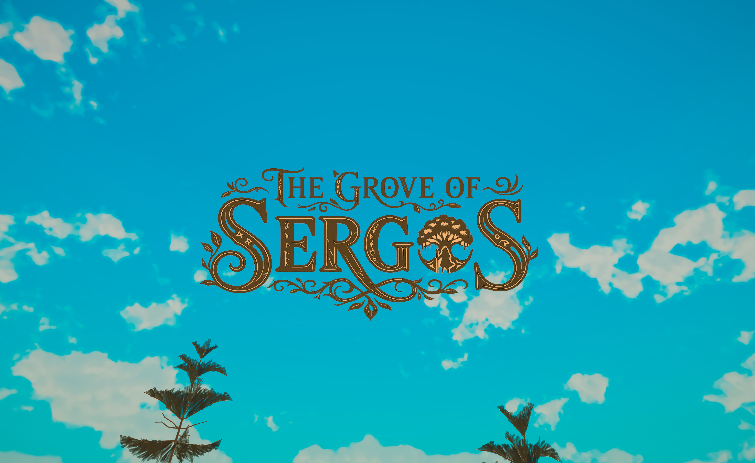
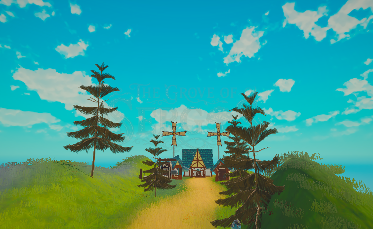
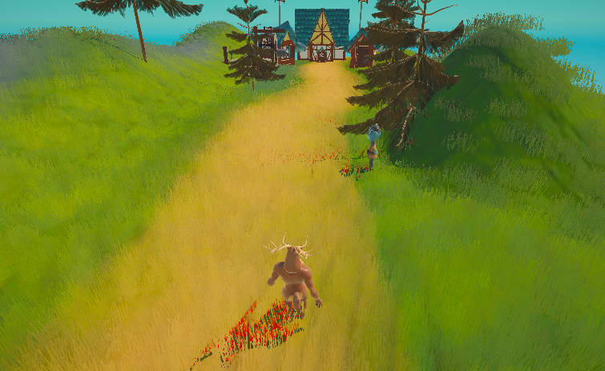
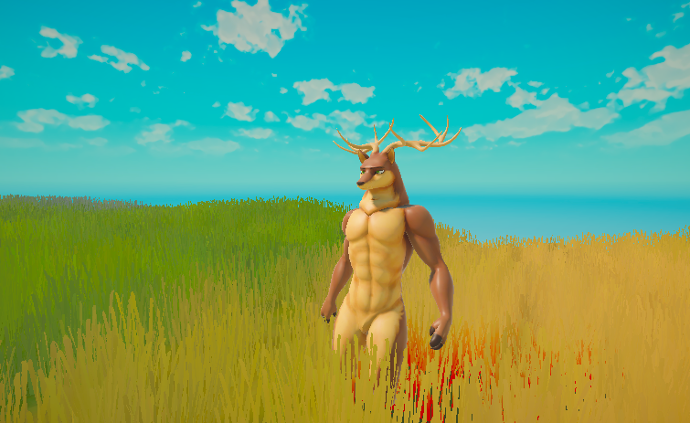

<div align="center">

# The Last Groove: Zaad's Journey

**A quiet forest. A village in danger. A traveler who chooses to stay.**

A stylized fantasy adventure prototype built with **Unity 6**, **C#**, **Timeline**, and **Cinemachine**.

[The story](#the-story) · [Gallery](#gallery) · [Behind the scenes](#behind-the-scenes) · [Run the project](#run-the-project)

</div>



## The story

Zaad, a deer traveler, is passing through a forest when a frightened villager calls for help. A monster is approaching the village, threatening to raid it and burn its homes. Zaad decides to intervene.

The experience moves from a peaceful opening into character encounters, a second cinematic sequence, and a boss confrontation. It is a student project exploring how **environment, camera movement, and playable action can tell one continuous story**.

## Gallery

### A world worth protecting



Stylized foliage, warm grass, and a bright sky establish the calm that the story later puts at risk.

### A call for help



The camera keeps conversations inside the world, using character framing and cuts to guide attention.

### The threat arrives



The second sequence shifts the tone toward confrontation and sets up the boss encounter.

*Images are captured directly from the Unity Game View. This is an in-development prototype.*

## What I built

- **Narrative sequencing:** two Timeline sequences, character staging, camera cuts, and transitions back into player control.
- **Environment composition:** a stylized forest and village assembled to support the story's progression from calm to danger.
- **Third-person gameplay:** movement, camera control, interaction, and combat.
- **Configurable boss behavior:** pursuit, facing, attack preparation, cooldowns, and melee/area attacks driven by ScriptableObjects.
- **Supporting game systems:** health, projectiles, inventory, item pickups, quests, progression, and victory/game-over feedback.

My work centers on game logic, cinematic sequencing, visual composition, and integrating these systems into a playable experience. Models, animations, textures, and other imported resources include third-party assets; see [credits](docs/CREDITS.md).

## Behind the scenes

| Area | Implementation |
| --- | --- |
| Engine and rendering | Unity **6000.0.56f1**, Universal Render Pipeline |
| Cinematics | Timeline **1.8.9**, Cinemachine **3.1.5** |
| Input | Unity Input System **1.14.2** |
| Boss attacks | `BossAttackDefinition` assets separate tuning data from behavior |
| Combat and progression | C# components and shared combat events |
| Quests and items | ScriptableObject definitions with runtime managers |

### A practical animation lesson

The boss originally combined scripted movement with animation root motion. Those two sources could move it in competing directions. Combat now uses scripted movement with root motion disabled; the boss checks its facing before starting a hit and tracks the target during preparation. Attack ranges were also tightened so it approaches before striking.

An editor validation command checks the prefab, target preservation, facing, area-attack reach, and root stability across idle, walking, and both attack animations: **Tools → Validate Boss Combat**. This complements, rather than replaces, playtesting the complete encounter.

### Visual direction

The visual research focuses on three ideas: a welcoming fantasy landscape, conversations framed within the environment, and camera language that makes the threat feel present. References include *The Legend of Zelda*, *Titan Quest*, and *Genshin Impact*.

Read the [visual research and design rationale](docs/VISUAL_RESEARCH.md) for the reference breakdown.

## Run the project

1. Clone this repository.
2. In **Unity Hub**, choose **Add project from disk** and select the **`Narrative Systems`** folder inside the repository.
3. Open with **Unity 6000.0.56f1** and let Unity restore packages and import assets.
4. Open **`Assets/Scenes/SampleScene.unity`**.
5. Enter **Play Mode**. The opening cinematic introduces the world before gameplay.

The Unity project folder retains its original coursework name; the game's portfolio title is **The Last Groove: Zaad's Journey**.

### Controls

| Input | Action |
| --- | --- |
| **W A S D** | Move |
| **Shift** | Run |
| **Mouse** | Look around |
| **Left click** | Primary attack / fireball |
| **Right click** | Alternate attack |
| **F** | Interact / pick up items |
| **E** | Toggle inventory |
| **Esc** | Release the cursor |

### Project layout

```text
Narrative Systems/
├── Assets/
│   ├── Scenes/           # Main playable scene
│   ├── scripts/          # Boss, entities, managers, quests, and UI
│   ├── Configs/          # Enemy and attack definitions
│   ├── animations/       # Animation assets and controllers
│   ├── Editor/           # Boss validation and screenshot tools
│   └── *.playable        # Timeline sequences
├── Packages/
└── ProjectSettings/
docs/
├── screenshots/          # Selected in-engine captures
├── VISUAL_RESEARCH.md
└── CREDITS.md
```

## Project status

**Student prototype / portfolio project created at Saxion University.** This project was developed for the **Narrative Systems** course, whose objective was to design and implement an interactive narrative experience where visual direction, cinematics, and gameplay support one coherent story. Open and play it in the Unity Editor; no standalone release is provided here. Combat tuning, animation contact timing, and the full cinematic-to-gameplay flow remain areas for continued playtesting.

## Author

**Yago Phellipe Matos Lopes** · [GitHub](https://github.com/YagoDevs) · [LinkedIn](https://www.linkedin.com/in/yago-phellipe/)

Developed for **Narrative Systems**. See [credits and asset notes](docs/CREDITS.md) for imported resources.
